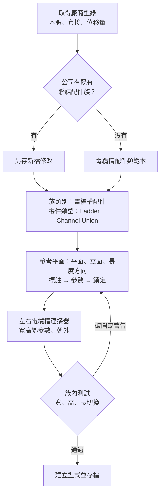
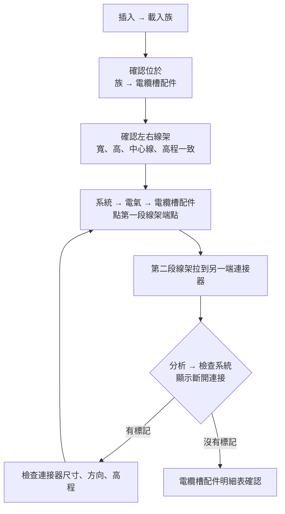

# CT Expansion Guide

**電纜槽伸縮節族製作與專案使用指南｜Revit 2027**

> **狀態：文件核對版／待實機驗收**
> 內容已對照 Autodesk 官方文件，但尚未在 Revit 2027 繁中版實機操作確認。所有數值為示意，以廠商型錄為準。

給要在 Revit 2027 建立「電纜槽伸縮節」配件族的工程人員看的操作指南：從族類別、零件類型、參數表、參考平面與連接器設定，到載入專案放置、驗證連通性、常見卡關排解，一次整理完。每一項結論都標示是官方文件確認、依據推測、還是仍待實機驗證，避免把沒查證過的細節當成事實照抄。

大字、單欄、手機可讀的靜態網頁，純 HTML／CSS／JavaScript，不需要建置工具，可以直接部署到 GitHub Pages。

## 檔案

| 檔案 | 用途 |
|---|---|
| `index.html` | 主頁面 |
| `styles.css` | 樣式（大字、深淺色、列印） |
| `app.js` | 字級 A−／A＋、深淺色切換、檢查清單勾選記憶（只存在本機瀏覽器） |
| `README.md` | 本說明 |

外部資源：Google Fonts（Noto Sans TC）、jsDelivr 上的 Mermaid（繪製流程圖）。無法連線時，流程圖會顯示原始碼，其餘內容不受影響。

## 部署到 GitHub Pages

1. 建立新的 repository，把四個檔案上傳到根目錄。
2. Settings → Pages → Source 選 **Deploy from a branch**，Branch 選 `main`、資料夾選 `/ (root)`。
3. 儲存後等待部署完成，網址會顯示在同一頁。

> repository 設為 Public 時，網頁任何人都能看到。內容若有公司資料，請先確認再公開。

## 內容大綱

1. 核心觀念：本體總長度、外觀總長、套接長度、允許位移量、安裝間隙
2. 開新族與族類別（零件類型 Ladder Union／Channel Union）
3. 參數表（固定長度為主，可變長度為選用）
4. 參考平面與鎖定
5. 連接器檢查
6. 族內測試
7. 專案載入與放置
8. 驗證（顯示斷開連接）與明細表
9. 疑難排解
10. 最低驗收清單
11. 尚未確認事項
12. 資料來源

## 流程

### 族製作

### 專案使用

## 尚未確認

- 繁中 2027 介面的零件類型名稱、「顯示斷開連接」的位置與字樣（目前依 2016 版文件）
- 廠商實際尺寸
- 聯結類配件夾在兩段線架中間時的實際放置行為
- 網格式線架的零件類型歸屬
- 製造商、型號在繁中 2027 是否為「識別資料」內建參數

## 資料來源

- [Part Types – Revit 2027 Help](https://help.autodesk.com/cloudhelp/2027/ENU/Revit-Customize/files/GUID-54F9DD0A-6F46-4B52-8F58-B8FA630F14EA.htm)
- [Add Cable Tray Fittings – Revit 2027 Help](https://help.autodesk.com/cloudhelp/2027/ENU/Revit-MEPEng/files/GUID-F88D8921-5F1E-4FE2-B2A8-1ACBFCC6286A.htm)
- [Load Families in Context – Revit 2027 Help](https://help.autodesk.com/cloudhelp/2027/ENU/Revit-Model/files/GUID-C3A489CA-9FD2-408D-80CA-DCE0E42FACF8.htm)
- [Specify Family Category and Parameters – Revit 2026 Help](https://help.autodesk.com/cloudhelp/2026/ENU/Revit-Customize/files/GUID-68EFCA67-4913-4E00-AB9E-F2E6A7BEF8C6.htm)
- [Place a Connector – Revit 2022 Help](https://help.autodesk.com/cloudhelp/2022/ENU/Revit-Customize/files/GUID-BE4F1954-1049-46EC-BCB2-D03D27B4C77A.htm)
- [About Check Duct Systems – Revit 2016 Help](https://help.autodesk.com/cloudhelp/2016/ENU/Revit-Model/files/GUID-F70AE6D6-8AF4-496F-8175-1BBD737FF8C2.htm)
- [PartType Enumeration – Revit API 2015](https://www.revitapidocs.com/2015/4182a378-a3cc-7f0c-87b3-d230c2540267.htm)
- [How to set Fitting of Union like a cable tray – Autodesk Community](https://forums.autodesk.com/t5/revit-api-forum/how-to-set-fitting-of-union-like-a-cable-tray-by/td-p/10159799)
- [How to install Revit project and family templates – Autodesk](https://www.autodesk.com/support/technical/article/caas/sfdcarticles/sfdcarticles/How-to-install-Revit-project-and-family-templates.html)
